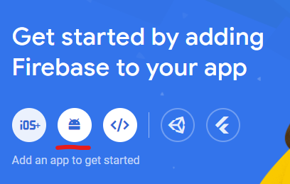

# cis3186-sso
Code to be used during SSO tutorial (to be held on 07/12/22 14:00)

# Team 2
- Adam Ruggier
- Gerard Coleiro
- Luke Chen
- Robert Mifsud

# Prerequisites
- Verify you have Node.js installed (in cmd/terminal). You can download it form [here](https://nodejs.org/en/download/).
```
node -v
# v14.15.3
npx -v
# 6.14.9
```
- Instal Expo Application Services CLI tool
```
npm install --global eas-cli
```
- Ensure you have an [Expo](https://expo.dev/signup) account. If you attended any of the react-native tutorials with Eman and used Expo Go you should have an account already.
- Install Expo Go app [IOS](https://apps.apple.com/us/app/expo-go/id982107779)/[Android](https://play.google.com/store/apps/details?id=host.exp.exponent&hl=en&gl=US). It could be the case that you might not be able to run project on the University network(eduroam), in which case we suggest you use your phone's hotspot.
# Implementation
The code required to implement this feature is fairly simple however an extensive setup process is involved. All necessary steps are outlined below.

## Project creation and initial setup

Create new expo project with blank template. You can name it 'SSO'
```
npx create-expo-app --template
```
Navigate to project directory
```
cd SSO
```
Run project, scan the qr code from your Expo Go app and verify that it works. (Ensure your laptop and phone are on the same network)
```
npx expo start
```
Install the React Native Firebase "app" module to the root of your React Native project with npm.
```
npm install --save @react-native-firebase/app
```
Install the React Native Firebase Authentication package
```
npm i @react-native-firebase/auth
```
Install expo-dev-client
```
npx expo install expo-dev-client
```
Import thse in your [App.js](SSO/App.js)

`import 'expo-dev-client';`

`import auth from '@react-native-firebase/auth';`

Build **.apk**. Prompt may ask you to log-in using your Expo account. Select *Y* when prompted to create EAS project and build new keystore.

This process may take 5~10 minutes.
```
eas build --profile development --platform android
```
Install google sign-in package
```
npx expo install @react-native-google-signin/google-signin
```
After installing the package, add it as a plugin under "expo" in your [app.json](SSO/app.json) file as follows
```
{
  "expo": {
    "plugins": ["@react-native-google-signin/google-signin"],
    //
    //
```
Finally, import it to your [App.js](SSO/App.js)

`import { GoogleSignin } from '@react-native-google-signin/google-signin';`

## Setting up Firebase project
- Load up [firebase.google.com](https://firebase.google.com/)
- Click on 'Get Started' and 'Create Project'. You can name your project 'SSOGoogle'
- Add firebase to an Android app


- Fetch the package name from the [app.json](SSO/app.json) file and paste it to the site.
- Get SHA-1 credentials in the terminal:
```
eas credentials
# Select default options except when asked for build credentials in which case use the down arrow and select create new build credentails
```
- Copy the SHA-1 key from the new set of credentials (**not default**) and paste to your Firebase project
- **Do not** download the google-services.json file just yet
- Click **next** and continue to your Firebase App console


- Click the gear in the top left-hand corner to open up your project settings, scroll to the bottom
- Copy the **default** SHA-1 key from the terminal and add it to your Firebase app using the **Add fingerprint** button
- Now you can go ahead and download the *google-services.json* file
- Select Build/Authentication from the side menu and select 'Get started'
- Select 'Google' toggle it on to enable it and hit **Save**

Now you can add the file in your [app.json](SSO/app.json) under expo/android as such:
```
{
  "expo": {
    //
    //
    "android": {
      "googleServicesFile": "./google-services.json",
       //
       //
       //
```
- Do not forget to paste *google-services.json* file you downloaded earlier into your project directory
- Build the project again
```
eas build --profile development --platform android
```
Run the following command and copy the link to your newly built application
```
npx expo start --dev-client
```

## Writing code to implement solution
Configure webClientId. This can be found in *google-services.json* under **"oauth_client"**. Copy the client_id for client_type : 3.
```
export default function App() {
  GoogleSignin.configure({
    webClientId: '',
  });
  return (
    //
    //
```
Create two states, for when user is logged in and logged out

`import React, { useState, useEffect } from 'react';`

Set initialising state to block app from rendering while Firebase establishes a connection and a functiion to handle state changes.
```
export default function App() {
  // Set an initializing state whilst Firebase connects
  const [initializing, setInitializing] = useState(true);
  const [user, setUser] = useState();

  // Handle user state changes
  function onAuthStateChanged(user) {
    setUser(user);
    if (initializing) setInitializing(false);
  }

  useEffect(() => {
    const subscriber = auth().onAuthStateChanged(onAuthStateChanged);
    return subscriber; // unsubscribe on unmount
  }, []);

  if (initializing) return null;
  //
  //
  //
```
Declare the default *onGoogleButtonPress()* function
```
async function onGoogleButtonPress() {
  // Check if your device supports Google Play
  await GoogleSignin.hasPlayServices({ showPlayServicesUpdateDialog: true });
  // Get the users ID token
  const { idToken } = await GoogleSignin.signIn();

  // Create a Google credential with the token
  const googleCredential = auth.GoogleAuthProvider.credential(idToken);

  // Sign-in the user with the credential
  return auth().signInWithCredential(googleCredential);
  const user_sign_in = auth().signInWithCredential(googleCredential)
  user_sign_in.then((user) =>{
    console.log(user);
  })
  .catch((error) => {
    console.log(error);
  })
}
```
Replace the default
# References
- https://www.youtube.com/watch?v=d_Vf41Sb0v0
- https://rnfirebase.io/auth/social-auth
- https://github.com/react-native-google-signin/google-signin
